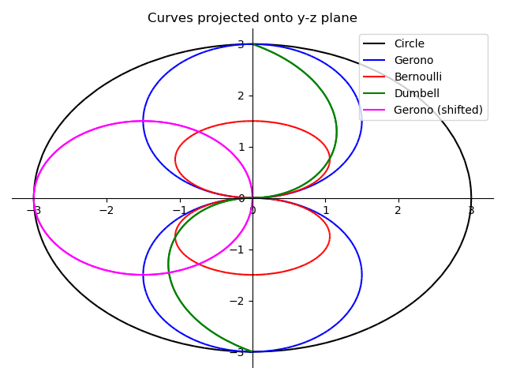

# Curves from twisted circles

This program takes the parametric equations for arbitrary simple closed 
curves and finds the corresponding functional rotation that "deforms" 
a circle into a 3D curve for which the 2D projection is this simple
closed curve.

The rotation is accomplished using a functional unit quaternion 
which can be shown to be a 1-parameter homeomorphism. 

The problem is indeterminate, so there are multiple solutions; we randomly
select for the purpose of plotting the resultant curves.

For this work, I colloborated with OpenAI's GPT-3.5 model via the [OpenAI API](https://chat.openai.com/)

# Notation
- Points on the curves (p) are expressed as "pure" quaternions (i.e. p=(0,x,y,z)).
- Rotations (q) are expressed as "unit" quaternions (i.e. norm(q) = 1).
- We perform a quaternion rotation using Hamilton products: p2 = q(p1)q'

More detailed theoretical foundations are available here: 

P. T. Jardine and S. N. Givigi, ["Flocks, Mobs, and Figure Eights: Swarming as a Lemniscatic Arch"](https://ieeexplore.ieee.org/document/9931405), *IEEE Transactions on Network Science and Engineering*, 2022.

## Plots

Here are some results. Note that the Bernoulli curve does not make use of a 
pure quaternion and so is not strictly homeomorphic. 

    

    

    

