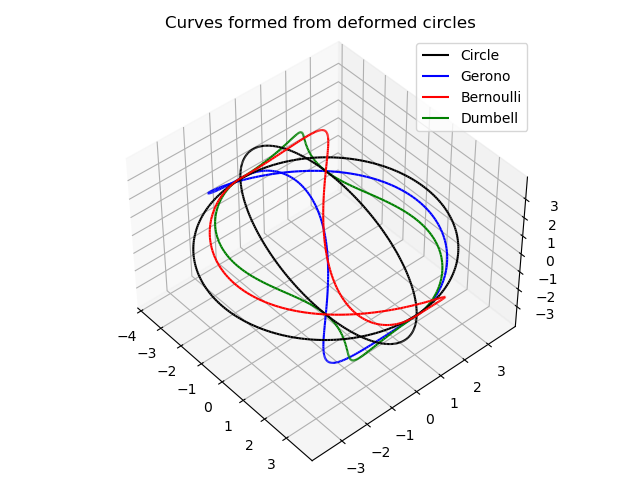
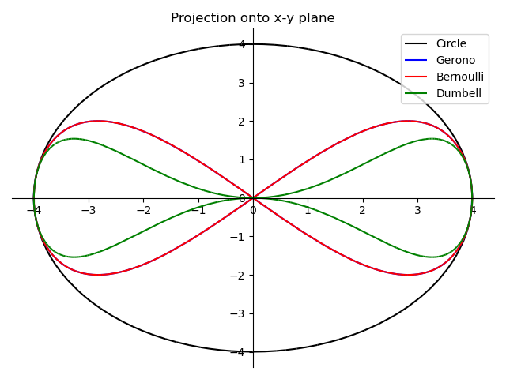

# Curves from twisted circles

This program takes the parametric equations for arbitrary simple closed 
curves and finds the corresponding functional rotation that "deforms" 
a circle into a 3D curve for which the 2D projection is this simple
closed curve.

The rotation is accomplished using a functional unit quaternion 
which can be shown to be a 1-parameter homeomorphism. 

The problem is indeterminate, so there are multiple solutions; we randomly
select for the purpose of plotting the resultant curves.

Points are expressed as "pure" quaternions (i.e. p=(0,x,y,z))
Rotation are expressed as "unit" quaternions (i.e. norm(q) = 1)

For this work, I colloborated with OpenAI's GPT-3.5 model via the [OpenAI API](https://chat.openai.com/)

## Plots

Here are some results.

    

    

